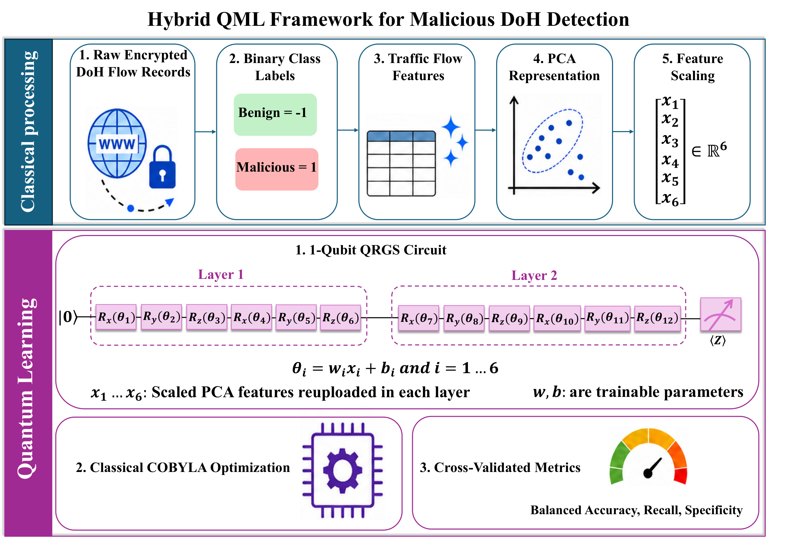

# Capacity is not the bottleneck: compact data-reuploading quantum classifiers for encrypted DNS-over-HTTPS traffic

Code for the QRGS (Quantum Reuploading Grid Search) study of benign-vs-malicious
DNS-over-HTTPS (DoH) traffic classification on the **BCCC-CIRA-CIC-DoHBrw-2020**
dataset.

This repository contains **code only** — the dataset and all generated results
(per-run JSON, aggregated CSVs, figures) are not included and are regenerated by
running the pipeline below.



*Figure 1. Overview of the QRGS data-reuploading quantum classification framework for encrypted DNS-over-HTTPS traffic.*

## What the code does

Each QRGS model is a data-reuploading `EstimatorQNN` trained with COBYLA on a
noiseless statevector simulator. The study sweeps a fixed grid of
**72 configurations** (2 feature scalers × {qubits, layers, entanglement,
reuploading strategy}) across **5 seeds** and **4 training sizes**
{100, 200, 500, 1000} — 1,440 configuration-seed runs in total — and compares
against classical and Fourier-feature baselines on the same representation.

Three methodological choices distinguish this pipeline (see `src/rerun_foldcontained.py`):

- **Leakage-free evaluation:** PCA (28 → 6 components) and class balancing are fit
  **inside each training fold only**; the held-out fold is projected with the
  train-fit basis.
- **Parameter-scaled optimization budget:** the COBYLA evaluation cap is
  `epochs = 5·(N+1)` where `N = c·Q·L` is the trainable-parameter count
  (`c = 12` symmetrical, `c = 6` asymmetrical reuploading), giving every circuit
  the same effort per parameter.
- **Threshold-independent scoring:** continuous ⟨Z⟩ scores are saved per test
  sample (ROC-AUC, PR-AUC) and per-iteration COBYLA loss is saved (convergence
  curves). Label convention: benign = −1, malicious = +1.

## Repository layout

```
QRGS-DoH-classifier/
├── src/                            # the pipeline (importable package)
│   ├── rerun_foldcontained.py      # MAIN QRGS runner (fold-contained, budget-scaled)
│   ├── classical_fc.py             # classical + Fourier-feature baselines (same folds)
│   ├── 00_main.py                  # original single-config entry point
│   ├── core/quantum_reup.py        # data-reuploading circuit builder
│   ├── core/ibmcloud.py            # optional IBM Quantum Runtime init (token from file)
│   ├── algorithms/                 # QRGS (sim + QPU) and classical classifiers
│   ├── preprocessing/              # doh.py (dataset prep), methods.py (PCA/scalers)
│   └── helpers/                    # metrics + utilities
├── grid/
│   └── run_grid_fc.py              # parallel, checkpointed launcher over the full grid
├── figures/
│   ├── figlib.py                   # shared style + CSV loading + helpers
│   ├── fig3.py … fig8.py           # results figures (read the aggregated CSVs)
│   ├── generate_figure2_v2.py      # Fig. 2 protocol schematic
│   ├── aggregate_seed_results.py   # per-run JSON  ->  summary tables
│   └── compare_qrgs_seed_classical.py / audit_results.py
├── requirements.txt
├── quantum_config.example.json     # template for IBM Quantum credentials (optional)
├── LICENSE
└── .gitignore
```

## Installation

```bash
python -m venv .venv && source .venv/bin/activate      # or a conda env (Python 3.10)
pip install -r requirements.txt
```

## Data

Obtain **BCCC-CIRA-CIC-DoHBrw-2020** from the Canadian Institute for Cybersecurity
(BCCC refined release) and place the CSV at `data/BCCC-CIRA-CIC-DoHBrw-2020.csv`
(or point `--dataset_path` / `$QRGS_DATA` elsewhere). The original DoH source is
CIRA-CIC-DoHBrw-2020 (MontazeriShatoori et al., 2020).

## Reproducing the results

**1. Build the feature cache** (cleans, imputes, caches the 28-feature matrix):
```bash
python src/rerun_foldcontained.py --prep \
       --dataset_path data/BCCC-CIRA-CIC-DoHBrw-2020.csv --raw_dir results/raw
```

**2. Run the full QRGS grid** (72 configs × 5 seeds × 4 sizes, parallel + checkpointed):
```bash
python grid/run_grid_fc.py --workers 8          # add --dry_run to preview the grid + budget
```
Per-run outputs (`all_metrics.json`, `train_loss.json`, `scores.json`) land under
`results/results_fc/T<size>/seed_<seed>/<run_name>/`. Re-running skips completed
runs. A single config can also be run directly:
```bash
python src/rerun_foldcontained.py \
       --dataset_path data/BCCC-CIRA-CIC-DoHBrw-2020.csv --raw_dir results/raw \
       --run_dir results/example --feature_scaler min0max2pi \
       --q_num_qubit 4 --q_num_layers 8 --q_entanglement true \
       --q_reup_method symmetrical --epochs 385 --seed 7 \
       --train_count 1000 --test_count 4000 --n_splits 3
```

**3. Classical / Fourier baselines** on the identical fold-contained PCA:
```bash
python src/classical_fc.py --dataset_path data/BCCC-CIRA-CIC-DoHBrw-2020.csv --raw_dir results/raw
```

**4. Aggregate** the per-run JSON into the summary CSVs the figure scripts read.
The scripts in `figures/` take `--results-root` / `--out-dir` arguments (their
defaults point at the authors' layout — set them to your `results/results_fc`).
The figure layer (`figures/figlib.py`) expects these CSVs in `figures/`:
`qrgs_rerun_aggregated.csv`, `classical_fc_aggregated.csv`, `perfold_fc.csv`,
`convergence_fc.csv`, `convergence_budget.csv`, `roc_curves.csv`, `pr_curves.csv`.

**5. Generate the figures** (after the CSVs are in `figures/`):
```bash
cd figures && python fig3.py && python fig4.py && python fig5.py \
            && python fig6.py && python fig7.py && python fig8.py
```

## Grid definition

| Axis | Levels |
|------|--------|
| Feature scaler | `min0max2pi` (0→2π), `min0max1` (0→1) |
| Qubits `Q` | 1, 2, 4 |
| Layers `L` | 2, 4, 6, 8 |
| Entanglement | on / off (multi-qubit only) |
| Reuploading | symmetrical (`c=12`), asymmetrical (`c=6`) |
| Seeds | 7, 13, 37, 42, 101 |
| Training sizes | 100, 200, 500, 1000 |

Single-qubit circuits have no entanglement/asymmetrical variants → 8 + 32 + 32 = **72** configs.

## Optional: IBM Quantum hardware

`src/algorithms/qnn_reup_classifier_QPU.py` + `src/core/ibmcloud.py` support
QPU execution. Copy `quantum_config.example.json` to `quantum_config.json`, add
your IBM Quantum API token, and pass its path. **Never commit a real token**
(`quantum_config.json` is git-ignored).

## Acknowledgments

This code builds on the data-reuploading quantum classifier implementation in
[acomphealth/quantum-reup](https://github.com/acomphealth/quantum-reup), which we
adapted and extended for the DoH grid-search study.

## Citation

If you use this code, please cite the paper (Aminpour, Banad, Sharif; INQUIRE Lab,
University of Oklahoma). Full reference will be added on publication.

## License

Released under the MIT License (see `LICENSE`).
